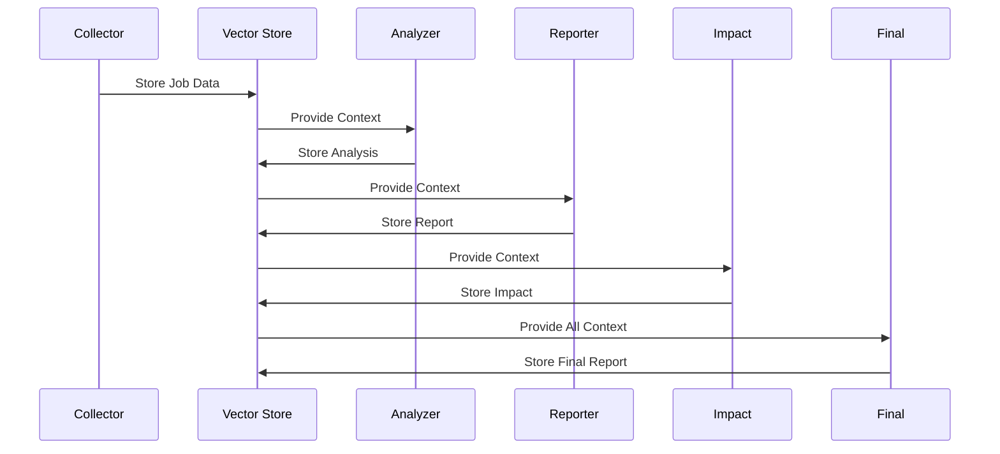

# AI Agentic RAG Job Market Research

An advanced job market analysis system using agentic AI and RAG (Retrieval-Augmented Generation) to analyze tech job trends, skills, and AI's impact on the job market.

## Architecture

```ascii
+------------------------------------------+
|             Job Market Analyzer           |
+------------------------------------------+
                    |
        +----------+-----------+
        |                      |
+---------------+    +------------------+
| Data Pipeline |    | Analysis Pipeline|
+---------------+    +------------------+
    |                        |
    v                        v
+---------------+    +------------------+
|  Collection   |    |  Tech Analysis   |
|    Agent      |    |     Agent        |
+---------------+    +------------------+
    |                        |
    v                        v
+---------------+    +------------------+
|   SerpAPI     |    |  Market Report   |
| Integration   |    |     Agent        |
+---------------+    +------------------+
                           |
                           v
                    +------------------+
                    |   AI Impact      |
                    |     Agent        |
                    +------------------+
                           |
                           v
                    +------------------+
                    | Final Report     |
                    |    Agent         |
                    +------------------+
```

## LlamaIndex & LangGraph Integration

```ascii
+---------------------------------------------+
|              LlamaIndex & LangGraph         |
+---------------------------------------------+
                     |
         +-----------+-----------+
         |                       |
+------------------+   +-------------------+
|    LlamaIndex    |   |    LangGraph     |
|    Components    |   |    Workflow      |
+------------------+   +-------------------+
         |                       |
         v                       v
+------------------+   +-------------------+
|  Vector Store    |   |   State Machine  |
|    (FAISS)      |   |   Graph Flow     |
+------------------+   +-------------------+
         |                       |
         v                       v
+------------------+   +-------------------+
|  Document Store  |   |   Agent Tasks    |
|    & Index      |   |   & Transitions  |
+------------------+   +-------------------+
         |                       |
         v                       v
+------------------+   +-------------------+
|    Retrieval     |   |    Workflow      |
|    Pipeline      |   |    Execution     |
+------------------+   +-------------------+
```

## Agentic RAG Workflow

```mermaid
graph TB
    %% Data Sources
    subgraph DataSources[Data Sources]
        SerpAPI[SerpAPI]
        LocalData[Local Data Storage]
    end

    %% Vector Store & Processing
    subgraph VectorProcessing[Vector Store & Processing]
        VectorDB[FAISS Vector DB]
        DocProcessor[Document Processor]
        EmbedModel[OpenAI Embeddings]
    end

    %% Agent System
    subgraph AgentSystem[Agent System]
        JDC[JobDataCollector]
        TA[TechAnalyzer]
        MR[MarketReporter]
        IA[AIImpactAnalyzer]
        FR[FinalReporter]
    end

    %% LangGraph System
    subgraph LangGraphSystem[LangGraph Workflow]
        StateManager[State Manager]
        WorkflowGraph[Workflow Graph]
        ErrorHandler[Error Handler]
    end

    %% LLM Integration
    subgraph LLMSystem[LLM System]
        GPT4[GPT-4]
        RAGEngine[RAG Engine]
        PromptManager[Prompt Manager]
    end

    %% Output System
    subgraph OutputSystem[Output System]
        JSONStore[JSON Storage]
        MDReports[Markdown Reports]
        Analysis[Analysis Results]
    end

    %% Connections
    SerpAPI -->|Job Data| JDC
    LocalData -->|Cached Data| JDC
    JDC -->|Documents| DocProcessor
    DocProcessor -->|Processed Docs| VectorDB
    EmbedModel -->|Embeddings| VectorDB

    JDC -->|State Update| StateManager
    TA -->|State Update| StateManager
    MR -->|State Update| StateManager
    IA -->|State Update| StateManager
    FR -->|State Update| StateManager

    VectorDB -->|Context| RAGEngine
    GPT4 -->|Completions| RAGEngine
    PromptManager -->|Templates| RAGEngine

    RAGEngine -->|Enhanced Analysis| AgentSystem
    WorkflowGraph -->|Coordinates| AgentSystem
    StateManager -->|Manages| WorkflowGraph
    ErrorHandler -->|Monitors| WorkflowGraph

    JDC -->|Job Data| JSONStore
    TA -->|Tech Analysis| JSONStore
    MR -->|Market Report| JSONStore
    IA -->|Impact Analysis| JSONStore
    FR -->|Final Report| JSONStore

    MR -->|Market Report| MDReports
    IA -->|Impact Report| MDReports
    FR -->|Comprehensive Report| MDReports

    JSONStore -->|Data| Analysis
    MDReports -->|Reports| Analysis

    %% Styles
    classDef source fill:#f9f,stroke:#333,stroke-width:2px
    classDef storage fill:#bbf,stroke:#333,stroke-width:2px
    classDef agent fill:#bfb,stroke:#333,stroke-width:2px
    classDef system fill:#fbb,stroke:#333,stroke-width:2px
    classDef output fill:#fff,stroke:#333,stroke-width:2px

    class SerpAPI,LocalData source
    class VectorDB,DocProcessor,EmbedModel storage
    class JDC,TA,MR,IA,FR agent
    class StateManager,WorkflowGraph,ErrorHandler,GPT4,RAGEngine,PromptManager system
    class JSONStore,MDReports,Analysis output
```



## Agentic RAG Architecture

```ascii
+--------------------------------------------------+
|                  Agentic RAG System               |
+--------------------------------------------------+
                        |
    +-------------------+-------------------+
    |                   |                   |
+----------+     +-----------+     +-------------+
| Retrieval |     |  Agents   |     | Generation |
|  System   |     | Pipeline  |     |  System    |
+----------+     +-----------+     +-------------+
    |                 |                   |
    v                 v                   v
+----------+     +-----------+     +-------------+
| Document |     |   Agent   |     |    LLM     |
| Store    |<--->| Workflow  |<--->| Interface  |
+----------+     +-----------+     +-------------+
    |                 |                   |
    v                 v                   v
+----------+     +-----------+     +-------------+
| Vector   |     |  State    |     | Response   |
| Index    |<--->| Machine   |<--->| Generation |
+----------+     +-----------+     +-------------+
```

### RAG Components Implementation

1. **Document Processing & Storage**
```python
class DocumentProcessor:
    def __init__(self):
        self.index = VectorStoreIndex()
        self.store = DocumentStore()
        
    def process_job_data(self, jobs: List[Dict]):
        # Convert jobs to documents
        documents = [
            Document(
                text=job["description"],
                metadata={
                    "title": job["title"],
                    "company": job["company_name"],
                    "location": job["location"]
                }
            ) for job in jobs
        ]
        
        # Index documents
        self.index.add_documents(documents)
        
        # Store original documents
        self.store.add_documents(documents)
```

2. **Vector Retrieval System**
```python
class VectorRetrieval:
    def __init__(self):
        self.vector_store = FAISS()
        self.embedder = OpenAIEmbeddings()
        
    def retrieve_similar(self, query: str, k: int = 5):
        # Get query embedding
        query_embedding = self.embedder.embed_query(query)
        
        # Find similar documents
        similar_docs = self.vector_store.similarity_search_by_vector(
            query_embedding,
            k=k
        )
        
        return similar_docs
```

3. **Agent Coordination System**
```python
class AgentCoordinator:
    def __init__(self):
        self.workflow = StateGraph(JobMarketState)
        self.agents = {
            "collector": JobCollectorAgent(),
            "analyzer": JobAnalyzerAgent(),
            "reporter": MarketReporterAgent(),
            "impact": AIImpactAnalyzerAgent(),
            "final": FinalReporterAgent()
        }
        
    def setup_workflow(self):
        # Add nodes
        for name, agent in self.agents.items():
            self.workflow.add_node(name, agent.execute)
            
        # Add edges with conditions
        self.workflow.add_conditional_edges(
            "collector",
            self.should_continue,
            {
                "analyzer": "analyzer",
                "reporter": "reporter",
                "impact": "impact",
                "final": "final",
                END: END
            }
        )
```

4. **RAG-Enhanced Analysis**
```python
class RAGAnalyzer:
    def __init__(self):
        self.retriever = VectorRetrieval()
        self.llm = OpenAI()
        
    def analyze_with_context(self, query: str, context_docs: List[Document]):
        # Retrieve relevant documents
        similar_docs = self.retriever.retrieve_similar(query)
        
        # Combine with current context
        all_context = similar_docs + context_docs
        
        # Generate enhanced prompt
        prompt = self.generate_prompt(query, all_context)
        
        # Get LLM response
        response = self.llm.complete(prompt)
        
        return response
```

### Agent Workflow Implementation



### State Management

```python
class JobMarketState(TypedDict):
    """State management for job market analysis workflow."""
    job_data: Optional[List[Dict]]
    tech_analysis: Optional[Dict]
    market_report: Optional[Dict]
    ai_impact: Optional[Dict]
    final_report: Optional[Dict]
    error: Optional[str]
    force_new_collection: bool

class StateManager:
    def __init__(self):
        self.state = JobMarketState(
            job_data=None,
            tech_analysis=None,
            market_report=None,
            ai_impact=None,
            final_report=None,
            error=None,
            force_new_collection=False
        )
        
    def update_state(self, key: str, value: Any):
        if key in self.state:
            self.state[key] = value
            
    def get_state(self) -> JobMarketState:
        return self.state
```

### RAG Query Enhancement

The system uses advanced RAG techniques for better analysis:

1. **Hybrid Search**
```python
class HybridSearcher:
    def search(self, query: str):
        # Semantic search
        semantic_results = self.vector_store.similarity_search(query)
        
        # Keyword search
        keyword_results = self.keyword_index.search(query)
        
        # Combine and rerank results
        combined = self.reranker.rerank(
            query,
            semantic_results + keyword_results
        )
        
        return combined
```

2. **Context Window Management**
```python
class ContextManager:
    def manage_context(self, documents: List[Document]):
        # Split into chunks
        chunks = self.chunker.split_documents(documents)
        
        # Maintain relationships
        chunk_graph = self.build_chunk_graph(chunks)
        
        # Select relevant chunks
        relevant = self.select_chunks(chunk_graph)
        
        return relevant
```

3. **Dynamic Prompting**
```python
class DynamicPrompter:
    def generate_prompt(self, query: str, context: List[Document]):
        # Analyze query intent
        intent = self.analyze_intent(query)
        
        # Select prompt template
        template = self.select_template(intent)
        
        # Fill template with context
        prompt = template.format(
            query=query,
            context=self.format_context(context)
        )
        
        return prompt
```

### Agent Specialization

Each agent is specialized for its task:

1. **Collector Agent**: Focuses on data gathering and initial processing
   - SerpAPI integration
   - Data validation
   - Initial structuring

2. **Analyzer Agent**: Handles technical analysis
   - Tech stack identification
   - Skill requirement analysis
   - Trend detection

3. **Reporter Agent**: Generates market insights
   - Pattern recognition
   - Market trend analysis
   - Report generation

4. **Impact Analyzer**: Focuses on AI's influence
   - AI adoption analysis
   - Role transformation tracking
   - Future prediction

5. **Final Reporter**: Synthesizes all analyses
   - Comprehensive analysis
   - Strategic insights
   - Recommendations

## Components

### 1. Job Agents

- **BaseJobAgent**: Base class with OpenAI integration and file operations
- **JobCollectorAgent**: Collects job data from SerpAPI or local storage
- **JobAnalyzerAgent**: Analyzes tech stack requirements
- **MarketReporterAgent**: Generates market analysis reports
- **AIImpactAnalyzerAgent**: Analyzes AI's impact on jobs
- **FinalReporterAgent**: Creates comprehensive final reports

### 2. Data Pipeline

- SerpAPI integration for job data collection
- JSON and Markdown data storage
- Vector storage using FAISS
- Document processing and indexing

### 3. Analysis Pipeline

- Tech stack requirement analysis
- Market trend analysis
- AI impact assessment
- Comprehensive report generation

### 4. LangGraph Integration

- State machine for workflow management
- Agent coordination and task transitions
- Asynchronous execution support
- Error handling and recovery

## Setup

1. Clone the repository
2. Install dependencies:
```bash
pip install -r requirements.txt
```

3. Set up environment variables:
```bash
OPENAI_API_KEY=your_openai_key
SERPAPI_API_KEY=your_serpapi_key
```

## Usage

Run the job market analysis workflow:
```bash
python agents/job_market_workflow.py
```

Optional flags:
- `--force-new`: Force new data collection instead of using cached data

## Output Files

The system generates several output files in the `data` directory:

1. Raw Data (JSON):
- `job_data.json`: Collected job postings
- `tech_analysis.json`: Tech stack analysis
- `market_report.json`: Market analysis
- `ai_impact_analysis.json`: AI impact analysis
- `comprehensive_report.json`: Final comprehensive report

2. Human-Readable Reports (Markdown):
- `market_report.md`: Market analysis report
- `ai_impact_analysis.md`: AI impact analysis report
- `comprehensive_report.md`: Final comprehensive report

## Architecture Details

### Agent System

Each agent is specialized for a specific task:
- Collection: Job data gathering and storage
- Analysis: Tech stack and market analysis
- Reporting: Report generation and insights
- Impact Analysis: AI impact assessment
- Final Reporting: Comprehensive report creation

### RAG Implementation

The system uses RAG for enhanced analysis:
1. Retrieval: Fetches relevant job data and previous analyses
2. Augmentation: Enhances data with structured insights
3. Generation: Creates detailed reports and analyses

### LangGraph Workflow

The workflow is managed by LangGraph:
1. State Management: Tracks analysis progress
2. Task Transitions: Coordinates agent activities
3. Error Handling: Manages failures and retries
4. Async Support: Handles concurrent operations

## Future Enhancements

1. Enhanced Data Collection
   - Additional job data sources
   - Real-time data updates
   - Historical trend analysis

2. Advanced Analysis
   - Skill demand prediction
   - Salary trend forecasting
   - Geographic market analysis

3. Visualization
   - Interactive dashboards
   - Trend visualization
   - Geographic heat maps

4. System Improvements
   - Parallel processing
   - Caching optimization
   - Advanced error recovery

## Contributing

1. Fork the repository
2. Create a feature branch
3. Commit your changes
4. Push to the branch
5. Create a Pull Request

## License

MIT License - see LICENSE file for details

### Agent Implementation Details

1. **JobDataCollectorAgent**
   ```python
   class JobDataCollectorAgent:
       def collect_jobs(self, force_new: bool) -> List[Dict]:
           # Try loading existing data first
           if not force_new:
               existing = self.load_existing_data()
               if existing:
                   return existing
           
           # Collect new data if needed
           return self.collect_from_serpapi()
   ```

2. **TechAnalyzerAgent**
   ```python
   class TechAnalyzerAgent:
       def analyze_tech_stack(self, descriptions: List[str]) -> Dict:
           # Process job descriptions
           analysis = self.llm.analyze_requirements(descriptions)
           
           # Save analysis results
           self.save_tech_analysis(analysis)
           return analysis
   ```

3. **MarketReporterAgent**
   ```python
   class MarketReporterAgent:
       def generate_report(self, job_data: List[Dict], tech_analysis: Dict) -> Dict:
           # Generate market insights
           report = self.llm.generate_market_report(job_data, tech_analysis)
           
           # Save both JSON and markdown
           self.save_report(report)
           self.save_markdown_report(report)
           return report
   ```

4. **AIImpactAnalyzerAgent**
   ```python
   class AIImpactAnalyzerAgent:
       def analyze_ai_impact(self, job_data: List[Dict], 
                           tech_analysis: Dict,
                           market_report: Dict) -> Dict:
           # Analyze AI's impact
           impact = self.llm.analyze_ai_impact(
               job_data, tech_analysis, market_report
           )
           
           # Save analysis results
           self.save_impact_analysis(impact)
           return impact
   ```

5. **FinalReporterAgent**
   ```python
   class FinalReporterAgent:
       def generate_comprehensive_report(self, job_data: List[Dict],
                                      tech_analysis: Dict,
                                      market_report: Dict,
                                      ai_impact: Dict) -> Dict:
           # Generate final insights
           report = self.llm.generate_final_report(
               job_data, tech_analysis, market_report, ai_impact
           )
           
           # Save comprehensive report
           self.save_comprehensive_report(report)
           return report
   ```

### State Management

The workflow uses LangGraph for state management:

```python
class JobMarketState(TypedDict):
    job_data: Optional[List[Dict]]
    tech_analysis: Optional[Dict]
    market_report: Optional[Dict]
    ai_impact: Optional[Dict]
    final_report: Optional[Dict]
    error: Optional[str]
    force_new_collection: bool
```

### RAG Implementation Details

1. **Document Processing**
   ```python
   def process_documents(self, jobs: List[Dict]) -> List[Document]:
       documents = []
       for job in jobs:
           doc = Document(
               text=job["description"],
               metadata={
                   "title": job["title"],
                   "company": job["company"],
                   "location": job["location"]
               }
           )
           documents.append(doc)
       return documents
   ```

2. **Vector Storage**
   ```python
   def store_documents(self, documents: List[Document]):
       # Create embeddings
       embeddings = self.embedder.embed_documents(
           [doc.text for doc in documents]
       )
       
       # Store in vector database
       self.vector_store.add_embeddings(
           embeddings,
           documents,
           metadatas=[doc.metadata for doc in documents]
       )
   ```

3. **Context Retrieval**
   ```python
   def get_relevant_context(self, query: str, k: int = 5) -> List[Document]:
       # Get query embedding
       query_embedding = self.embedder.embed_query(query)
       
       # Find similar documents
       similar_docs = self.vector_store.similarity_search_by_vector(
           query_embedding,
           k=k
       )
       
       return similar_docs
   ```

4. **Enhanced Generation**
   ```python
   def generate_with_context(self, query: str, 
                           context: List[Document]) -> str:
       # Create enhanced prompt
       prompt = self.create_prompt(query, context)
       
       # Generate response
       response = self.llm.complete(prompt)
       
       return response
   ```

### Workflow Execution

The workflow is executed through the main entry point:

```bash
# Run with existing data
python agents/main.py

# Force new data collection
python agents/main.py --force-new
