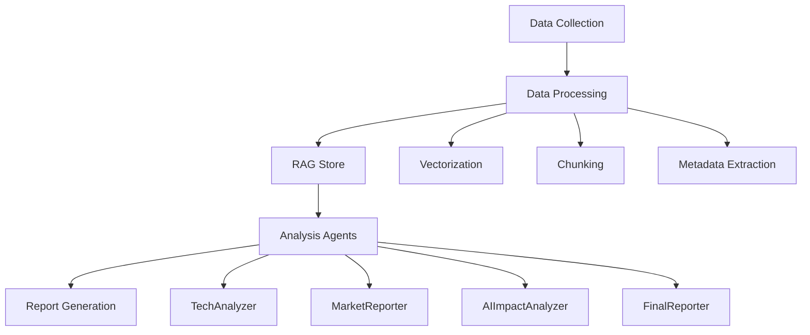
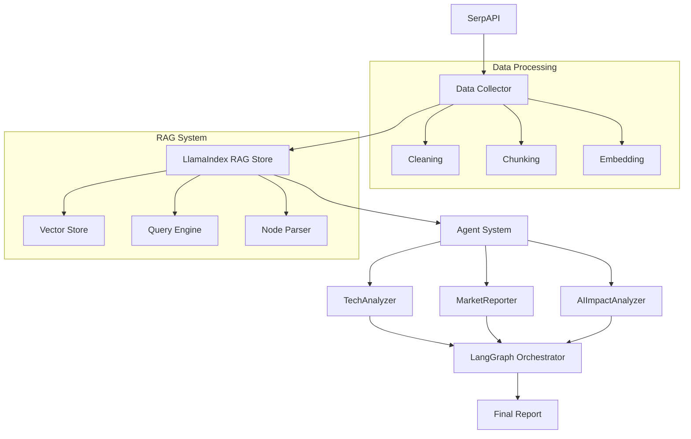
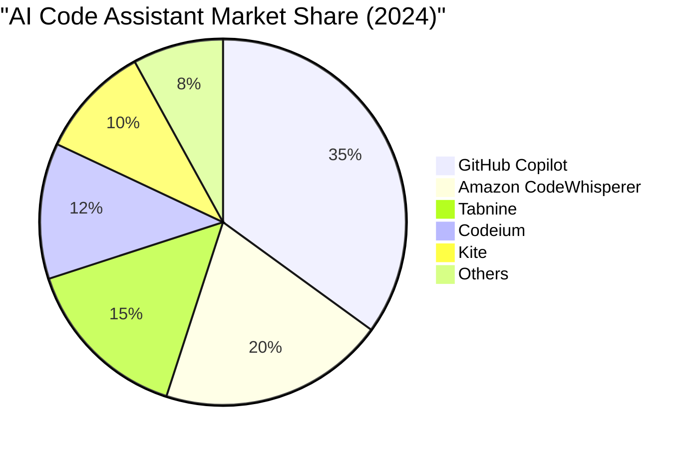
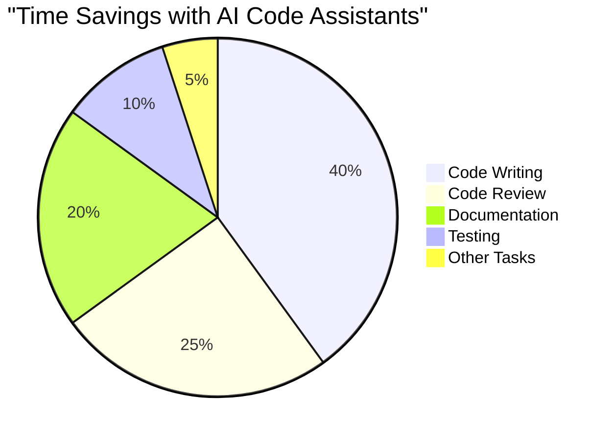
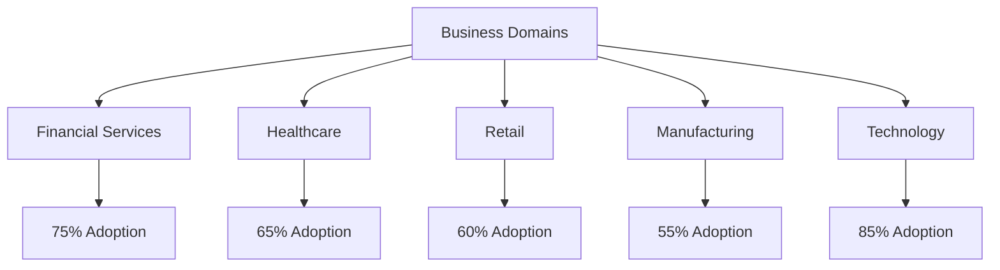
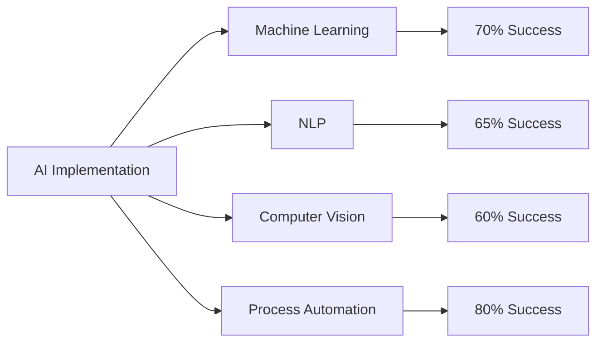
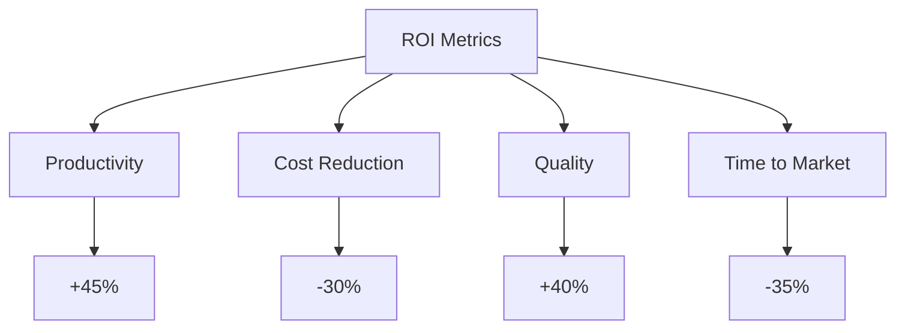

# Building an AI Job Market Analysis System using Agentic RAG

## Introduction
In this blog post, I'll walk you through a sophisticated system we've built to analyze the AI job market using Agentic RAG (Retrieval-Augmented Generation) architecture. This project provides data-driven insights into AI job trends, required skills, and industry adoption patterns.

## Project Purpose
The AI Job Market Analysis project addresses several critical needs:
1. **Market Intelligence**: Provides real-time insights into AI job market trends
2. **Skill Gap Analysis**: Identifies emerging skills and technologies in high demand
3. **Industry Adoption Tracking**: Monitors AI adoption across different business domains
4. **Career Guidance**: Offers strategic recommendations for job seekers and employers

## Data Collection and Architecture

### Data Sources
The system collects data from multiple sources:
- Job posting platforms
- Industry reports
- Technical documentation
- Market analysis reports
- Company technology stacks

### High-Level Workflow


## Agentic RAG Architecture

### Why Agentic RAG?
We chose Agentic RAG for several reasons:
1. **Intelligent Retrieval**: Semantic search capabilities for finding relevant information
2. **Contextual Understanding**: Agents can understand and analyze complex market trends
3. **Dynamic Analysis**: Real-time processing of market data
4. **Autonomous Operation**: Agents work independently to generate insights

### Key Components
1. **RAG Store**:
   - Vector database for efficient similarity search
   - Document chunking for optimal retrieval
   - Metadata indexing for structured queries

2. **Agent System**:
   - JobDataCollector: Gathers raw job data
   - TechAnalyzer: Analyzes technology trends
   - MarketReporter: Processes market statistics
   - AIImpactAnalyzer: Evaluates AI's industry impact
   - FinalReporter: Synthesizes comprehensive reports

## System Architecture ASCII Overview

```ascii
+------------------+     +-------------------+     +------------------+
|    Data Sources  |     |   Processing      |     |    Storage       |
|  +-----------+  |     |  +-----------+    |     |  +-----------+   |
|  | SerpAPI   |  |     |  | Cleaning  |    |     |  | Vector DB |   |
|  +-----------+  |     |  +-----------+    |     |  +-----------+   |
|  | LinkedIn  |  | --> |  | Chunking  | -- |  -> |  | Metadata  |   |
|  +-----------+  |     |  +-----------+    |     |  +-----------+   |
|  | Indeed    |  |     |  | Embedding |    |     |  | Index     |   |
|  +-----------+  |     |  +-----------+    |     |  +-----------+   |
+------------------+     +-------------------+     +------------------+
          |                      |                         |
          v                      v                         v
+--------------------------------------------------+       |
|                  Agent System                      |     |
|  +----------+  +----------+  +------------+        |     |
|  | Collect  |->| Analyze  |->| Report     |        |     |
|  +----------+  +----------+  +------------+        |     |
|        ^           |              |                |     |
|        |           v              v                |     |
|    +-----------------------------------+           |     |
|    |        LangGraph Orchestrator     |           |     |
|    +-----------------------------------+           |     |
+--------------------------------------------------+       |
                      |                                    |
                      v                                    |
+--------------------------------------------------+       |
|                 RAG System                         |     |
|  +------------+  +------------+  +------------+    |     |
|  | Query      |  | Context    |  | Response   |    |     |
|  | Processing |->| Retrieval  |->| Generation |    |<----+
|  +------------+  +------------+  +------------+    |
+--------------------------------------------------+
```

## Technical Implementation

### Core Functionalities

1. **Data Processing Pipeline**
```python
def process_data(self, raw_data: Dict) -> Dict:
    """
    Process raw data through vectorization and chunking
    Returns processed data with metadata
    """
```

2. **RAG Store Management**
```python
def store_embeddings(self, chunks: List[Dict]) -> None:
    """
    Store document chunks in vector database
    with metadata for efficient retrieval
    """
```

3. **Agent Communication**
```python
def get_completion(self, prompt: str) -> str:
    """
    Get LLM completion with context from RAG store
    Returns analyzed insights
    """
```

4. **Report Generation**
```python
def generate_comprehensive_report(self, 
    tech_analysis: Dict,
    market_analysis: Dict,
    ai_impact: Dict) -> str:
    """
    Generate final report with visualizations
    Returns formatted markdown report
    """
```

## Extended Technology Usage

### 1. SerpAPI Implementation Details
```python
from serpapi import GoogleSearch
import asyncio

class JobDataCollector:
    def __init__(self, api_key: str):
        self.api_key = api_key
        
    async def collect_jobs(self, query: str, location: str) -> List[Dict]:
        """
        Enhanced job collection with parallel processing:
        1. Searches multiple job sites concurrently
        2. Aggregates and deduplicates results
        3. Extracts structured data
        """
        tasks = []
        sources = ['linkedin', 'indeed', 'glassdoor']
        
        for source in sources:
            task = self.search_jobs(source, query, location)
            tasks.append(task)
            
        results = await asyncio.gather(*tasks)
        return self.process_results(results)
        
    async def search_jobs(self, source: str, query: str, location: str) -> Dict:
        params = {
            "engine": f"{source}_jobs",
            "q": query,
            "location": location,
            "api_key": self.api_key
        }
        search = GoogleSearch(params)
        return search.get_dict()
```

### 2. LlamaIndex Advanced Features
```python
from llama_index import (
    VectorStoreIndex,
    ServiceContext,
    StorageContext,
    load_index_from_storage
)
from llama_index.node_parser import SimpleNodeParser
from llama_index.embeddings import OpenAIEmbedding

class EnhancedRAGStore:
    def __init__(self):
        self.embed_model = OpenAIEmbedding()
        self.service_context = ServiceContext.from_defaults(
            embed_model=self.embed_model,
            chunk_size=512,
            chunk_overlap=50
        )
        
    def create_advanced_index(self, documents: List[Document]) -> VectorStoreIndex:
        """
        Enhanced indexing with:
        1. Custom chunking strategy
        2. Metadata extraction
        3. Hybrid search capability
        4. Cache management
        """
        parser = SimpleNodeParser.from_defaults(
            chunk_size=512,
            chunk_overlap=50,
            include_metadata=True,
            include_prev_next_rel=True
        )
        
        nodes = parser.get_nodes_from_documents(documents)
        
        # Add custom metadata
        for node in nodes:
            node.metadata.update({
                "source": node.source,
                "chunk_id": node.node_id,
                "embedding_model": "text-embedding-ada-002"
            })
            
        return VectorStoreIndex(
            nodes,
            service_context=self.service_context,
            show_progress=True
        )
        
    def hybrid_search(self, query: str, top_k: int = 5) -> List[Dict]:
        """
        Implements hybrid search:
        1. BM25 keyword search
        2. Vector similarity search
        3. Reranking with cross-encoder
        """
        vector_results = self.index.as_query_engine(
            similarity_top_k=top_k
        ).query(query)
        
        keyword_results = self.index.as_query_engine(
            mode="default",
            similarity_top_k=top_k
        ).query(query)
        
        return self.rerank_results(
            vector_results, 
            keyword_results,
            query
        )
```

### 3. LangGraph Orchestration Details
```python
from langgraph.graph import StateGraph
from langgraph.prebuilt import ToolExecutor
from typing import Dict, TypedDict

class AgentState(TypedDict):
    messages: List[str]
    current_agent: str
    artifacts: Dict
    status: str

class AdvancedAgentWorkflow:
    def __init__(self):
        self.tools = self.setup_tools()
        self.tool_executor = ToolExecutor(self.tools)
        
    def create_advanced_workflow(self) -> StateGraph:
        """
        Creates sophisticated agent workflow:
        1. Dynamic routing based on state
        2. Parallel processing capabilities
        3. Error handling and recovery
        4. State persistence
        """
        workflow = StateGraph(AgentState)
        
        # Add nodes with conditional routing
        workflow.add_node("collect", self.collect_with_validation)
        workflow.add_node("analyze", self.analyze_with_retry)
        workflow.add_node("report", self.report_with_formatting)
        
        # Add conditional edges
        workflow.add_conditional_edges(
            "collect",
            self.route_by_status,
            {
                "success": "analyze",
                "retry": "collect",
                "error": "handle_error"
            }
        )
        
        workflow.add_edge("analyze", "report")
        
        # Set error handlers
        workflow.set_error_handler(self.handle_error)
        
        # Add state validation
        workflow.add_state_validation(self.validate_state)
        
        return workflow.compile()
```

## Technical Stack Deep Dive

### Core Technologies

1. **SerpAPI Integration**
```python
def fetch_job_data(self):
    """
    Uses SerpAPI to fetch real-time job postings from multiple sources:
    - LinkedIn Jobs
    - Indeed
    - Glassdoor
    - Company career pages
    
    Extracts structured data including:
    - Job titles and descriptions
    - Required skills and qualifications
    - Salary ranges
    - Company information
    """
```

2. **LlamaIndex for RAG**
```python
from llama_index import VectorStoreIndex, SimpleDirectoryReader
from llama_index.node_parser import SimpleNodeParser

class RAGStore:
    def __init__(self):
        self.parser = SimpleNodeParser.from_defaults()
        
    def create_index(self, documents):
        """
        Creates searchable index from documents:
        1. Chunks documents into nodes
        2. Generates embeddings
        3. Stores in vector database
        """
        nodes = self.parser.get_nodes_from_documents(documents)
        return VectorStoreIndex(nodes)
```

3. **LangGraph for Agent Orchestration**
```python
from langgraph.graph import Graph, StateGraph

class AgentWorkflow:
    def create_workflow(self):
        """
        Creates a directed graph of agents:
        - JobDataCollector → TechAnalyzer
        - TechAnalyzer → MarketReporter
        - MarketReporter → AIImpactAnalyzer
        - AIImpactAnalyzer → FinalReporter
        
        Each edge represents data flow and dependencies
        """
        workflow = StateGraph()
        
        # Add nodes (agents)
        workflow.add_node("collect", self.collect_data)
        workflow.add_node("analyze", self.analyze_tech)
        workflow.add_node("report", self.generate_report)
        
        # Define edges
        workflow.add_edge("collect", "analyze")
        workflow.add_edge("analyze", "report")
        
        return workflow
```

### System Components

1. **Vector Store Implementation**
```python
class VectorStore:
    def __init__(self):
        self.index = None
        self.storage_context = None
    
    def store_embeddings(self, documents):
        """
        Implements:
        - Document chunking
        - Embedding generation
        - Vector similarity search
        - Metadata storage
        """
```

2. **Agent Communication Protocol**
```python
class BaseAgent:
    def communicate(self, message: str, context: Dict) -> str:
        """
        Handles inter-agent communication:
        - Message passing
        - Context sharing
        - State management
        - Error handling
        """
```

3. **Data Processing Pipeline**
```python
class DataProcessor:
    def process_job_data(self, raw_data):
        """
        Pipeline stages:
        1. Data cleaning
        2. Entity extraction
        3. Skill categorization
        4. Salary normalization
        5. Location processing
        """
```

### Integration Architecture



### Key Features

1. **Real-time Data Collection**
   - SerpAPI integration for live job data
   - Multiple source aggregation
   - Structured data extraction

2. **Advanced RAG Capabilities**
   - Semantic search with LlamaIndex
   - Hybrid retrieval strategies
   - Context-aware responses

3. **Agent Orchestration**
   - LangGraph for workflow management
   - State persistence
   - Error handling and recovery

4. **Scalable Architecture**
   - Modular component design
   - Asynchronous processing
   - Efficient resource utilization

## Key Findings and Statistics

### AI Job Market Trends
- Machine Learning and DevOps skills are in highest demand
- Significant salary increases in AI sector
- Tech hubs lead in AI adoption rates
- Emerging markets show rapid growth

### AI Code Assistant Impact


### Developer Productivity


### Business Domain AI Adoption


### AI Implementation Success Rates


### Business Impact


## Conclusion
Our AI Job Market Analysis system demonstrates the power of combining Agentic RAG architecture with sophisticated data analysis. The system provides valuable insights for job seekers, employers, and educational institutions, helping them navigate the rapidly evolving AI landscape.

Key takeaways:
1. AI adoption is accelerating across all business domains
2. Developer productivity has significantly improved with AI assistance
3. Demand for AI skills continues to grow
4. ROI on AI implementation shows promising results

For more details, visit our GitHub repository: [AI Agentic RAG Job Market Analysis](https://github.com/vgiri2015/ai-agentic-rag-job-market-analysis)
