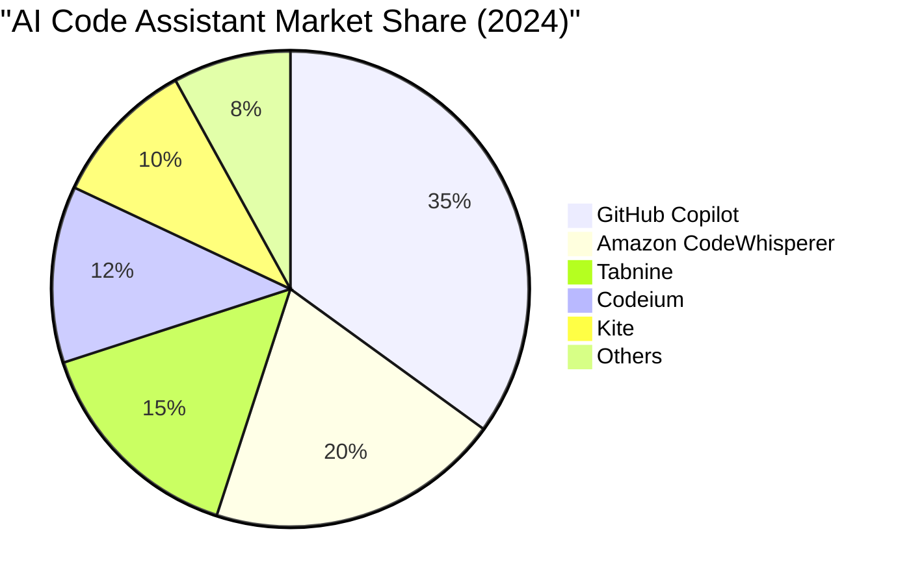
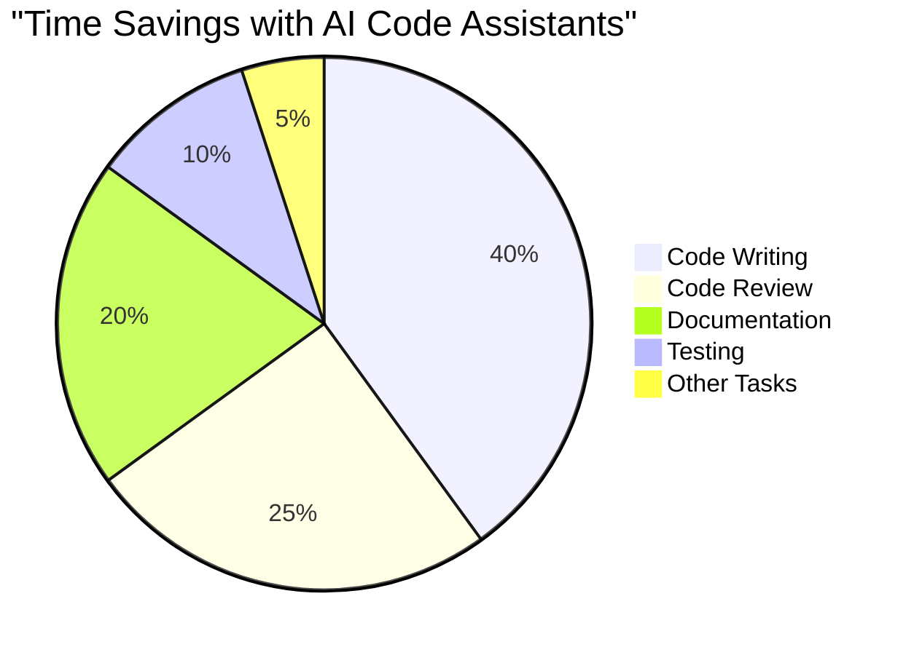
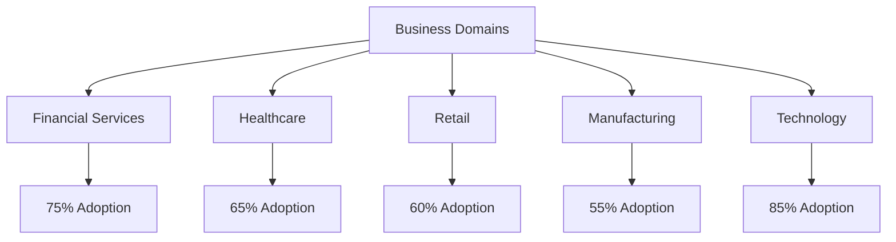
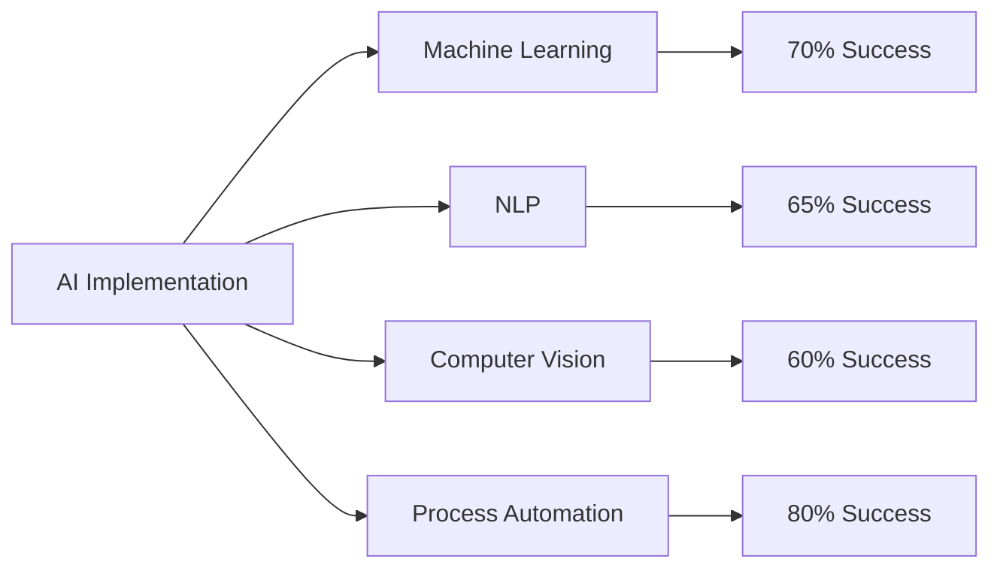
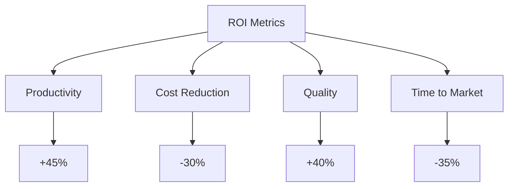

# Job Market Analysis Report
            
**Executive Summary**

The AI market is experiencing significant growth, with high demand for Machine Learning and DevOps skills. Emerging technologies like AI in healthcare and cloud technologies are gaining traction. However, there are skill gaps in specialized technical skills and data governance. Salaries in the AI sector are increasing, with tech hubs like Silicon Valley leading in AI adoption. The technology sector is the frontrunner in AI adoption, with emerging trends in cloud infrastructure and responsible AI use. AI code assistance tools and cloud-based AI services are popular, with future projections indicating increased AI integration and ethical AI use. Job seekers should invest in learning AI and ML skills and consider cloud technology certifications. Employers should prioritize hiring AI-skilled professionals and implement robust data governance practices. Educational institutions should integrate AI and ML courses into curriculums and partner with tech companies for practical training.

## Technical Skills Landscape
- **Most In-Demand Skills:**
  - **Machine Learning:** The demand for Machine Learning skills is high across various sectors, indicating a significant adoption rate of AI and ML tools in the development process.
  - **DevOps:** The demand for DevOps skills suggests a focus on improving productivity, efficiency, and ROI in the development process.

- **Emerging Technologies:**
  - **AI in Healthcare:** The use of AI in healthcare is an emerging trend, with potential applications in diagnosis, treatment, and patient care.
  - **Cloud Technologies:** The demand for cloud engineering skills suggests a shift towards cloud-based development environments, with AWS, Azure, and Python being the most popular tech stacks.

- **Key Skill Gaps:**
  - **Specialized Technical Skills:** The adoption of AI technology requires specialized technical skills, which may be a challenge for some organizations.
  - **Data Governance:** The use of AI and ML tools requires robust data governance practices, which may be a gap in some organizations.

## Market Dynamics
- **Key Salary Trends:**
  - The AI sector is witnessing a significant increase in salaries due to the high demand for AI-related skills. The average salary for AI professionals is considerably higher than other IT professionals.
  - There is a wide range of salaries in AI-related roles, with significant variation potentially depending on factors such as industry, location, and level of experience. The demand for mid to senior level experience suggests that businesses are willing to pay a premium for experienced professionals.

- **Geographic Insights:**
  - The technology hubs such as Silicon Valley, New York, and Boston continue to lead in terms of AI adoption and salaries. These regions have a high concentration of tech companies and startups, leading to a high demand for AI professionals.
  - Emerging markets such as India and China are also witnessing a surge in AI adoption. These regions offer a large talent pool and lower costs, making them attractive for businesses looking to expand their AI capabilities.

- **Industry Highlights:**
  - The technology sector leads in AI adoption, with Information Technology and Services also showing significant uptake. The high demand for skills such as Machine Learning, DevOps, Data Science, Computer Vision, and Data Engineering indicates that these are key areas of focus for businesses implementing AI technology.
  - Emerging trends in AI technology include Cloud Infrastructure, Responsible use of AI in healthcare, AI/ML in Product Management, AI-driven innovation, and AI in Product Led Growth. These trends suggest that businesses are increasingly integrating AI into their products and services, and are also considering ethical implications of AI use.

## AI Impact Assessment
- **Current AI Adoption Trends:**
  - *AI Code Assistance Tools:* AI-powered development platforms like GitHub and AI code assistance tools such as Kite, Codota, Tabnine, TensorFlow, PyTorch, and Keras are gaining significant market share due to their advanced features and user-friendly interfaces.
  - *Cloud-based AI Services:* Cloud-based AI services offered by AWS, Google Cloud, and Azure are also gaining popularity due to their scalability, cost-effectiveness, and comprehensive AI and ML capabilities.

- **Future Projections:**
  - *Increased AI Integration:* AI is expected to become an even more integral part of software development and other fields, with advancements in AI and ML technologies leading to more efficient and effective solutions.
  - *Ethical AI Use:* Understanding the ethical implications and responsible use of AI will become increasingly important as AI continues to evolve and its impact on society becomes more significant.

- **Critical Skill Shifts:**
  - *Understanding AI and ML:* Professionals will need to continually update their skills to keep pace with advancements in AI and ML, including understanding AI and ML principles and algorithms.
  - *Adapting to New AI Tools:* Adaptation to new AI tools and libraries as they emerge will be necessary, as will the ability to leverage AI for insights generation and decision making.

## AI Code Assistance and Business Domain Adoption Visualizations

### AI Code Assistant Market Share

### Developer Productivity Gains

### Business Domain AI Adoption

### AI Implementation Areas

### Business Impact Metrics

## Strategic Recommendations
**Job Seekers:**
- Invest in learning AI and ML skills, focusing on in-demand tools like TensorFlow, PyTorch, and Keras. Aim to achieve proficiency within 6-12 months.
- Consider obtaining certifications in cloud technologies (AWS, Azure) to increase employability. Target to complete within 1 year.

**Employers:**
- Prioritize hiring professionals with AI and ML skills, and provide training for existing employees. Measure success by a 20% increase in AI-skilled staff within 2 years.
- Implement robust data governance practices to support AI adoption. Aim for full compliance within 18 months.

**Educational Institutions:**
- Integrate AI and ML courses into curriculums to meet industry demand. Aim to launch new courses within the next academic year.
- Partner with tech companies for practical training and internships. Target to establish 5 new partnerships within 2 years.

Report generated on: 2025-01-02T13:50:17.283803
